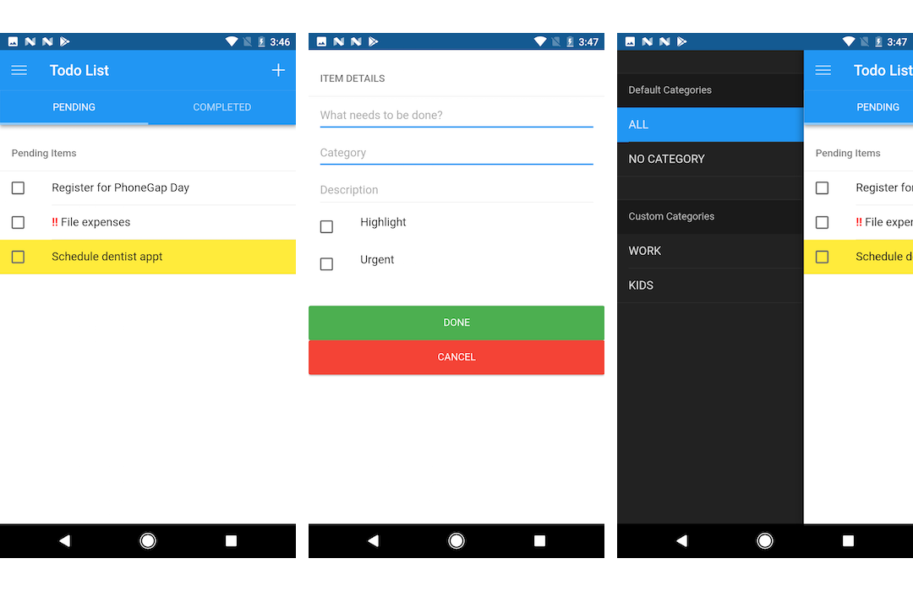
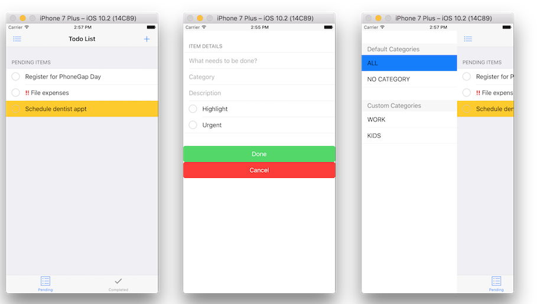

# A Todo's app template with PWA support using Vue.js and Framework7

This repo contains a PhoneGap template for a todo app that has been built as both a PhoneGap hybrid app and a Progressive Web App with caching for Offline Support. Try out the hosted demo [here](https://todos-app-pwa.firebaseapp.com) and be sure to check out the [online workshop](http://hollyschinsky.github.io/todos-app-pwa) to help you learn more.

### Screenshots
##### Android

##### iOS

##### PWA - Add to homescreen feature

### App Stack
The app was built with [Framework7](http://framework7.io) and [Vue.js](http://vuejs.org).

### Dependencies
- [phonegap-service-worker-plugin](https://github.com/phonegap/phonegap-plugin-service-worker)
- `phonegap-status-bar-plugin`

## Usage

    phonegap create todos-app --template phonegap-template-vue-f7-todos-pwa

    cordova create todos-app --template phonegap-template-vue-f7-todos-pwa

## Advanced Version of the Todo App 
Another version of this app is available with a more advanced config supporting Babel, Webpack and Hot Reloading
[Get it here](https://github.com/phonegap/phonegap-app-todo)

[Advanced version Demo here](https://hollyschinsky.github.io/todo-pwa/#!//)

### Resources
- [Associated Workshop](http://hollyschinsky.github.io/todos-app-pwa)
- [Progressive Web Apps](https://docs.google.com/document/d/1Lf33f2rcMisp0Xz1hOVevswds4KCpA5nSkptr-VjhKQ)
- [Todo's App Template with PouchDB + PWA](https://github.com/phonegap/phonegap-template-pwa)
